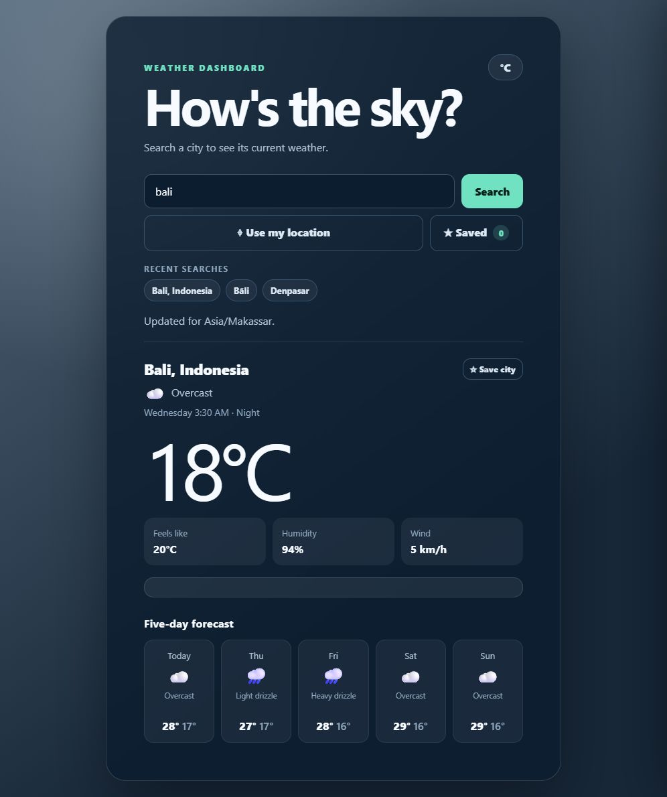

# Vayora

**Weather around you.**

Vayora is a responsive weather web application that displays current conditions and a five-day forecast for cities worldwide.



## Live demo

[View the deployed application](https://satgrid.github.io/Weather-forecast-app/)

## Features

- Search weather by city name
- Use the device's current location
- Display local time and day/night status
- View temperature, feels-like temperature, humidity, and wind speed
- View a five-day high/low temperature forecast
- Show weather icons and condition-based backgrounds
- Save up to three cities for quick access
- Remember the five most recent searches
- Display heat and rain advisories
- Handle invalid cities, denied location access, and offline errors
- Adapt to mobile and desktop screen sizes

## Technologies

- HTML5
- CSS3
- Vanilla JavaScript
- Fetch API and async/await
- Browser Geolocation API
- Browser localStorage
- GitHub Pages

## APIs

- [Open-Meteo Forecast API](https://open-meteo.com/en/docs) for current weather and forecasts
- [Open-Meteo Geocoding API](https://open-meteo.com/en/docs/geocoding-api) for city search
- [BigDataCloud reverse geocoding](https://www.bigdatacloud.com/docs/api-domains) for current-location names

No API key is required for this project.

## How it works

```text
City search -> coordinates -> weather API -> render current weather and forecast

Device location -> coordinates -> reverse geocoding -> location name + weather
```

## Run locally

Clone the repository:

```bash
git clone https://github.com/SatGrid/Weather-forecast-app.git
cd Weather-forecast-app
```

Start a local server:

```bash
python -m http.server 5500
```

Then open `http://localhost:5500` in a browser. A local server or HTTPS is recommended because browser geolocation may not work from a direct `file://` URL.

## Concepts learned

- Calling REST APIs and working with JSON
- Chaining dependent API requests
- Using async/await and try/catch/finally
- Updating the DOM from API data
- Rendering arrays with map
- Saving browser data with localStorage
- Handling geolocation permissions
- Building responsive and accessible UI states
- Using Git, GitHub, and GitHub Pages

## Future improvements

- Hourly forecast chart
- Temperature-unit selector
- Installable Progressive Web App support
- Improved saved-city drawer animations
- Automated tests
